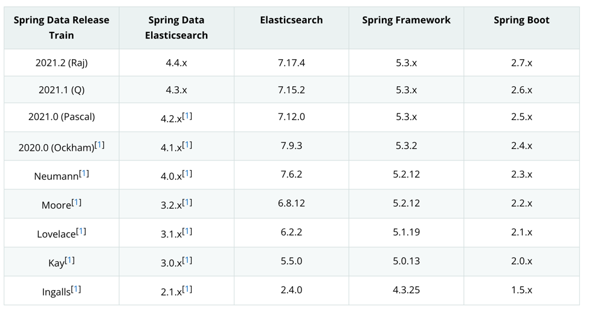

版本兼容问题
[https://docs.spring.io/spring-data/elasticsearch/docs/current/reference/html/#preface.requirements](https://docs.spring.io/spring-data/elasticsearch/docs/current/reference/html/#preface.requirements)



```docker
 docker pull elasticsearch:7.17.4 


docker run -itd --name es7 \
-p 9200:9200 -p 9300:9300 \
-e "discovery.type=single-node" \
-e ES_JAVA_OPTS="-Xms64m -Xmx256m" \
elasticsearch:7.17.4

```